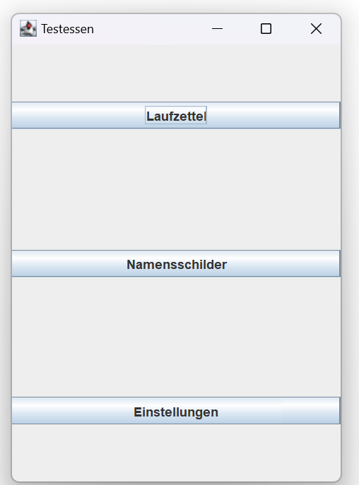
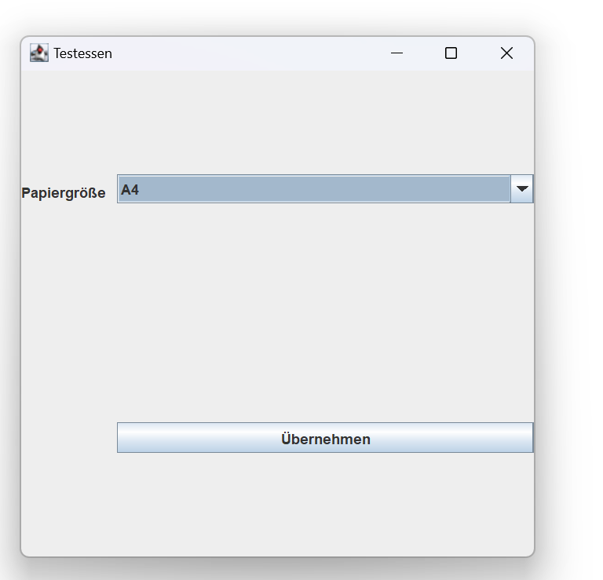
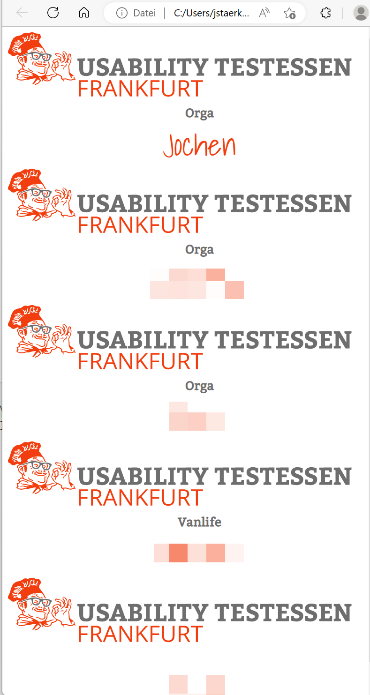
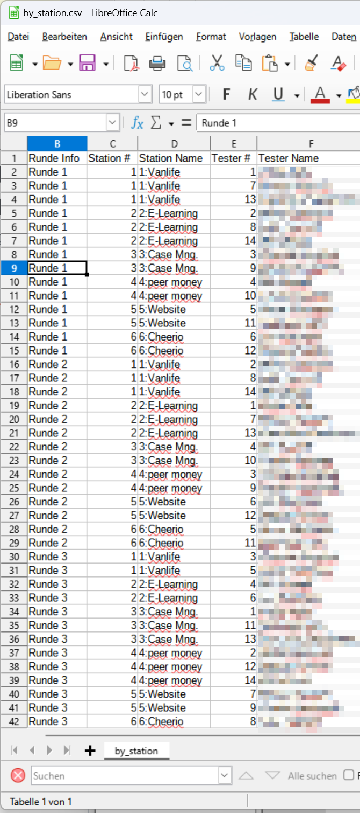

# Testessenplanner
([Englische Version](README.de.md) dieses Texts)

## Über
[Usability Testessen](https://usability-testessen.de/) sind Veranstaltungen, 
in denen reale Personen Apps, Onlineshops, Homepages, physische Geräte oder anderes auf Benutzbarkeit testen. 
Dafür bekommen sie von den Stationen, das heißt den Betreibern der zu testenden Artefakte, 
Aufgaben gestellt und haben 15 Minuten Zeit bevor gewechselt wird. 
Es gibt in der Regel fünf Wechsel, das heißt sechs Runden. 
Insgesamt wirkt das Format wie eine Kreuzung aus Speeddating und Guerilla Usability Test. 

Es wurde 2014 in Darmstadt erfunden und ist mit über 100 ehrenamtlichen Helfern derzeit in 32 Städten vertreten. Raum, WLAN, Strom, Pizza und Bier werden dabei von der Location gesponsort, weder bezahlen die Stationen Geld noch bekommen die Tester ein Honorar.

Dieser Testessenplanner ist eine kostenlose Open-Source Software für Mac, Windows und Linux, die beispielsweise die dafür notwendige Erstellung der Laufzettel (welcher Tester geht in welcher Runde an welche Station) vereinfacht und in Frankfurt entwickelt und mehrfach eingesetzt wurde.

Für dieses überraschend nicht-triviale nichtlineare Optimierungsproblem wird eine namens Bibliothek namens [Optaplanner](https://www.optaplanner.org/) eingesetzt, die das Problem mit dem Simulated Annealing-Algorithmus löst.


## Videos
Der Events
* 2 min [Stimmungsbild aus Wiesbaden](https://www.youtube.com/watch?v=2hyHDteriqE) (in german),
* 25min [Präsentation des Formats](https://www.youtube.com/watch?v=vCFaVl73f4g)  (in german).

## Download und Start


Erwartet werden im aktuellen Verzeichnis die Dateien „Shadows Into Light regular.ttf“, „Bitter regular.ttf“ und „logo-UT-Frankfurt.svg“ (aus Google Drive).


Die JAR-Datei aus der [releases](https://github.com/jstaerk/testessenplanner/releases) Seite kann dann mit einer
[Java JRE](https://www.azul.com/products/core/) >= version 1.8 wie folgt gestartet werden:

```java --jar testessenPlanner-2.0.0.jar```



## History
Neu in Version 2 ist die grafische Oberfläche und der Druck von Namensschildern. Verwendet
wurde die Software im Frankfurter Testessen "001" am 04.02.2016, Testessen #11 am 16.03.2017  und (Version 2) beim Testessen #25 am 18.02.2023 bei WestendTV.

## Handbuch
### Einstellungen


Unter Einstellungen kann das Papierformat festgelegt werden, wir bringen einen Labeldrucker mit und drucken auf 101x54mm Labels: Quer für Namenschilder und Hochkant für Laufzettel. Din A5 und Din A4 sind Alternativen.


### Namensschilder generieren

Unter Namensschilder gebt pro Zeile einen Namen (bei Labeldrucker: einen Vornamen) ein. Ihr könnt optional mit vertikalem Strich „|“ eine Firma vergeben, also bspw. „Jochen|Orga“ oder „Stefan|Station ABC“. 
Bei Klick auf Drucken wird eine badge.html-Datei generiert und im Browser zum Drucken geöffnet. Dort muss ggf. die Seiteneinstellung wiederholt werden.


### Vorlagedateien

Angelegt wird die Datei „badge-vorlage.twig“, die per Texteditor angepasst werden kann, für die Farbcodes eurer Stadt 
oder falls bspw. eine andere Datei als Logo dienen soll.


### Laufzettel generieren


Für Laufzettel müssen die Bezeichnungen der Runden, die Bezeichnungen der Stationen und die Tester  (jeweils eine(r) pro Zeile) in die drei Eingabefelder eingegeben werden. Die Namen der „Tester“ können auch Gruppen sein, gibt es zweierteams spricht grundsätzlich nichts gegen den Namen „Testergruppe 5“ und anschließendem Mehrfachdruck der HTML-Datei.

Die Berechnung erfolgt bis 10 Sekunden keine bessere Lösung gefunden wurde, in der Regel dauert das 10.3 Sekunden. Es gelten dieselben Ressourcen und Vorlagedateien nur heißt die Vorlagedatei in diesem Fall laufzettel-vorlage.twig. Zusätzlich zur HTML-Datei für den Laufzettel (laufzettel.html) wird automatisch auch eine badge.html für die Tester generiert und geöffnet.


Weiterhin werden zwei Tabellen erstellt, by_station.csv, die bspw. in LibreOffice oder MS Excel (trennzeichen „,“, Codierung UTF-8) geöffnet werden können und nochmal einen Überblick liefern, welcheR TesterIn in welcher Runde an welcher Station erwartet wird und, dieselben Daten anders angeordnet by_tester.csv, welche Station welcher Tester in welcher Runde anzulaufen hat.



## Beiträge

Fragen&Kommentare?
Jochen (Usability Testessen Team Frankfurt) jstaerk@usegroup.de


