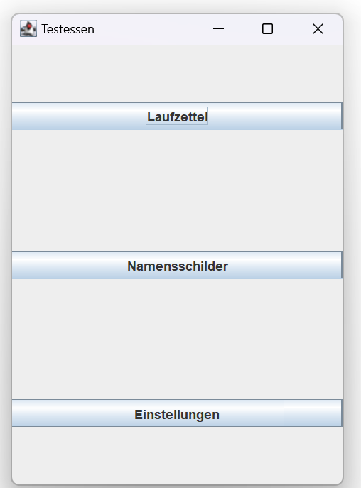
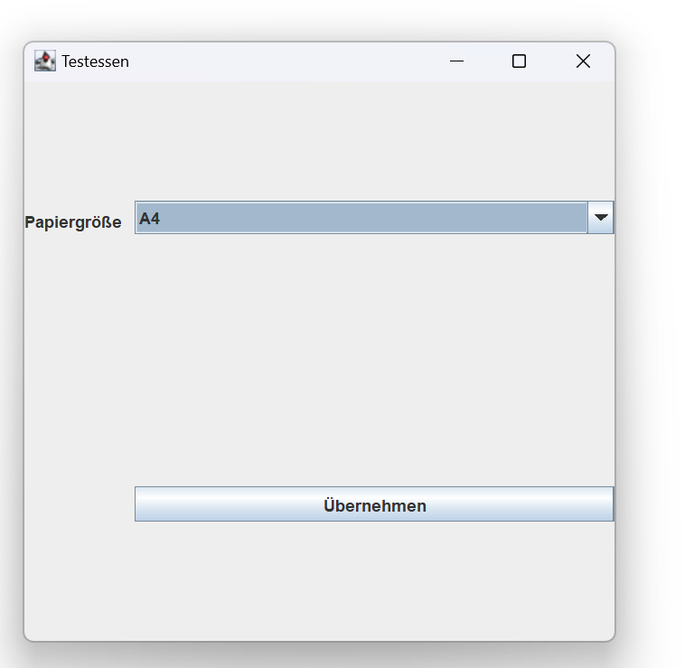
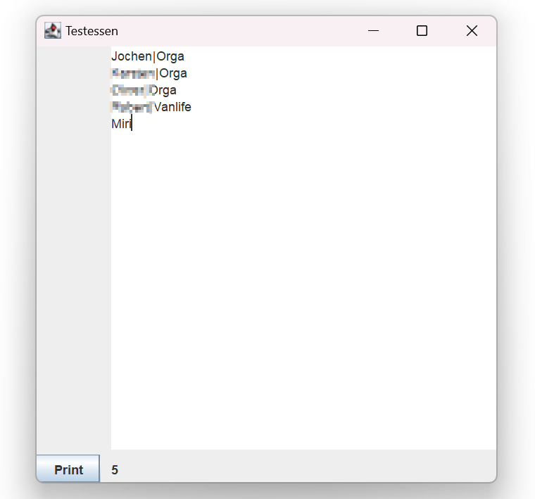
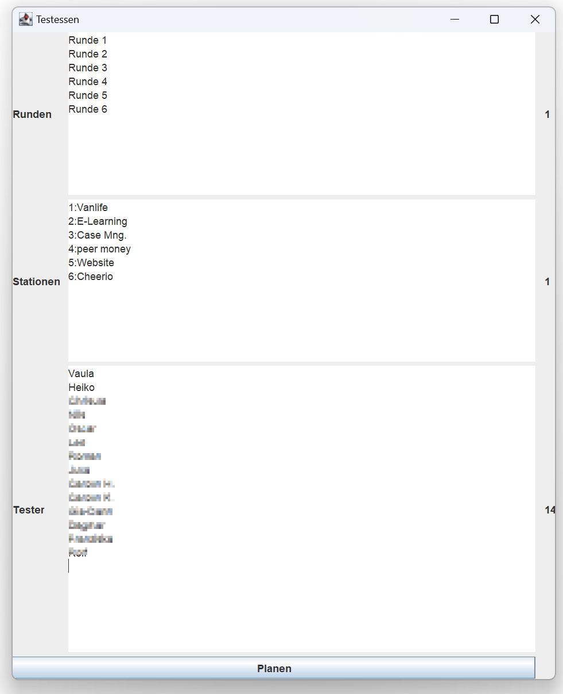
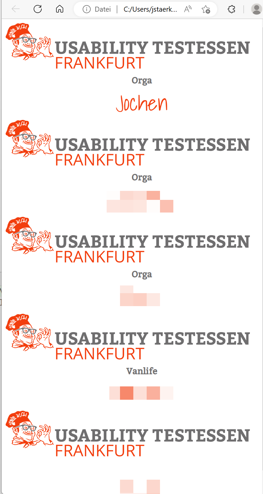
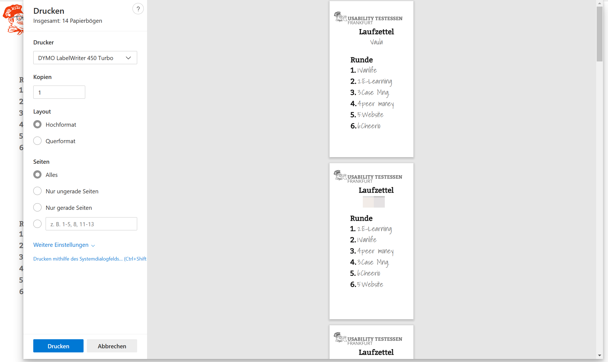
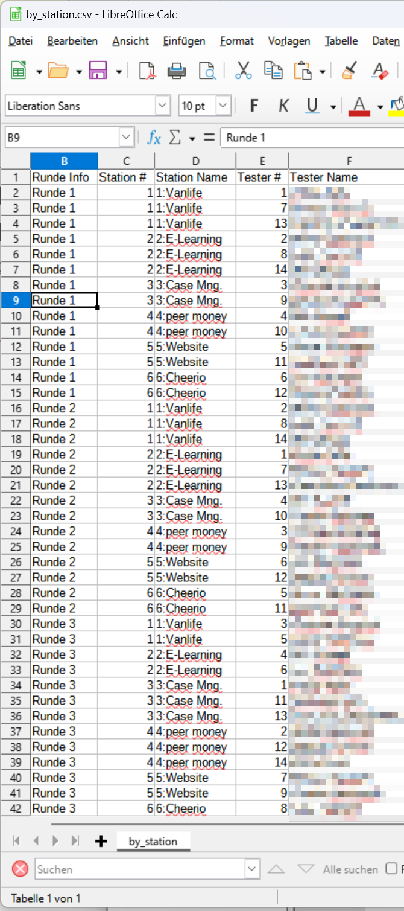

# Testessenplanner
([German version](README.md) of this text)

## About
[Usability Testessen](https://usability-testessen.org/) (~„Usability test diners“) are guerilla usability test events where real people test apps, onlineshops, homepages, physical devices or other artefacts for usability.
For this purpose the „Stations“, i.e. the developers of the artefacts under test, assign them tasks. The testers have 15 minutes before visiting the next station. Usually there are six „laps“ in the event. 

It looks and feels a bit like speeddating apps, not people. 

The format was invented in 2014 in Darmstadt, Germany, and currently over 100 volunteers help organizing it in 32 cities. 
Space, WLAN, power, pizza and beer is sponsored by the location, neither do the stations pay money nor do testers receive financial benefits. 


This application, Testessenplanner is a free open-source utility for Mac, Windows and Linux, which can e.g. generate  routing slips (which tester is assigned to which station in which lap) and was developed for 
and used in some Testessen in Frankfurt am Main, Germany.

In the background the generation of routing slips is a surprisingly complex non-linear optimization problem for which 
a library called [Optaplanner](https://www.optaplanner.org/) does all the heavy lifting, which in turn solves the problem with a algorithm called „Simulated Annealing“.

## Videos
Of the events
 * 2 min [impressions from Wiesbaden](https://www.youtube.com/watch?v=2hyHDteriqE) (in german), 
 * 25min [presentation of the format](https://www.youtube.com/watch?v=vCFaVl73f4g)  (in german).

## Download and Start

Download the JAR file from the [releases page](https://github.com/jstaerk/testessenplanner/releases).

A [Java JRE](https://www.azul.com/products/core/) >= version 1.8 is required.

By default the Testessen (Frankfurt) corporate identity will be used. Which expects the files "Shadows Into Light regular.ttf", "Bitter regular.ttf" and "logo-UT-Frankfurt.svg" (from Google Drive) in the current directory.
Once they are placed there the program can be started with a simple

```java --jar testessenPlanner-2.0.0.jar```



## History 
New in this version 2 is the graphical interface and the printing of name tags.
The software was developed for and used at the Frankfurt test dinner "001" on 2016-02-04, test dinner #11 on 2017-03-16 and (version 2) at test dinner #25 on 2023-02-18 at WestendTV.

## Manual
###Settings


Under Einstellungen (settings) you can specify the paper format, we bring a label printer and print on 101x54mm labels: landscape for name tags and portrait for dockets. Din A5 and Din A4 are alternatives.


###Generate Badges

Under Name tags enter one name per line (for label printer: one first name). You can optionally assign a company with a vertical line "|", e.g. "Jochen|Orga" or "Stefan|Station ABC".
When you click Print, a badge.html file is generated and opened in the browser for printing. In the HTML page print settings you may have to repeat the page setting already performed in the application.

###Templates

The file "badge-vorlage.twig" is created, which can be adapted by text editor, for the color codes of your city or if e.g. another file should serve as a logo.

###Generate routing slip


The calculation is finished when the solution did not improve for 10 seconds, usually this takes 10.3 seconds. The same resources and template files apply, only the template file in this case is called laufzettel-vorlage.twig.  In addition to the HTML file for the routing slip (laufzettel.html), a badge.html for the testers is automatically generated and opened.


Additionally two spreadsheets are created, by_station.csv, which again provides an overview of which testers come to which station in which lap and, the same data arranged differently by_tester.csv, which station which tester has to run to in which lap. You can open these files e.g. in LibreOffice or MS Excel (separator „,“, encoding UTF-8).

##Questions

Questions or comments?
Jochen (Usability Testessen Team Frankfurt) jstaerk@usegroup.de

